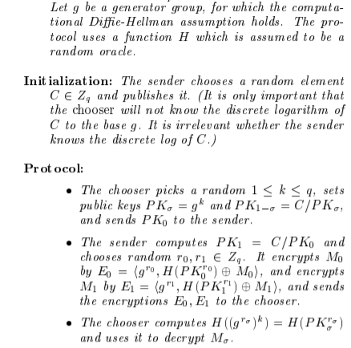

1. [中文] (#Chinese)
  * [介绍] (#jieshao)
  * [输入及限制] (#shuru)
  * [如何测试代码] (#ceshi)
  * [一些技术细节] (#xijie)
  * [安全性] (#anquan)
  * [改进] (#gaijin)
2. [English Version] (#English)
  * [Introduction] (#Intro) 
  * [Parameters and Restrictions] (#Para)
  * [How to test code] (#test)
  * [Some Tech Details] (#technical)
  * [Security] (#security)
  * [Future Improvements] (#future)

#  高效派生 1 of 2 不经意传输协议

## 介绍
我们用Java实现了 [[IKNP03]](https://www.iacr.org/archive/crypto2003/27290145/27290145.pdf) 里的高效派生多个不经意传输的协议。

在原论文中， 派生协议使用了一个 $(k, m)$-OT 的协议作为黑箱来生成 $(m, \ell)$-OT。 在我们的实现中， 我们先实现了 1 of 2 OT， 并用了 k 个这样的 OT 来代替 $(k, m)$-OT， 最后用论文里的技术来派生出 m 个OT。

## 输入及限制
发送者的输入首先为 $m\ (m<=20)$ 对消息，每一对消息由两个长度为**20**的字符串组成，这个输入由 String[m][2] 格式表示。 另外还有一个为安全参数的 int $k$ 作为输入。所以，发送者的输入为：

String[m][2] sInput

int k

以下为这个版本输入参数的一些限制（以作测试参考）：

* 输入消息的字符串必须长度为20 （原因在改进中提到）
* 输入的消息的对数 $m$ 须少于或者等于20对
* 由于是“派生” 所以 $k$ 应小于 $m$

接收者的输入首先为 $m$ 个选择， 由 0 或 1 表示， 这个输入由 int[m] 格式表示。 另外还有一个安全参数 int $k$ 作为输入， 此 $k$ 须与发送者的 $k$ 相同。 接受者的输入为

int[] choices

int k

* 注意选择数组的长度 $m$ 必须小于或等于20， 因为对应可选择的对数是小于等于20

##  如何测试代码
### 运行
1. 编译 Sender.java 和 Receiver.java
2. 在一个 terminal 运行 Sender.class 
3. 打开另一个 terminal， 运行 Reciever.class

### 改动输入

在改动输入进行测试时，仅需改动两个地方

发送者：

1. sInput ：   在 Sender.java 的 main 方法中， 在“test case initialization" 的注释下面的sInput ，须满足以下条件： sInput 必须是 String[m][2] 形式， 并且 $m <= 20$, 字符串的长度为**恰好20**
2. k :   在 sInput 下方初始化发送者alice的地方（Sender alice = new Sender(sInput, 10);）对发送者的安全参数进行更改， $k<20$

例子：  
sInput =  
["Alice01234567891234", "Bob01234567891234567"]  
["Pans0123456789123456", "Forks012345678912345"]  
... (less than 20 pairs of strings of length 20)  

Sender alice = new Sender(sInput, 10);  

接收者：

1. 在 Receiver.java 的 main 方法中， 在“test case initialization" 的注释下面初始化bob的地方（Receiver bob = new Receiver(new int[] {0, 1, 1, 0, 1, 0}, 10);) 对choices数组 进行更改， 注意保持安全参数 $k$ 一致

例子：  
choices =  
[0, 1, 1, 0, 1, 0] 

Receiver bob = new Receiver(new int[] {0, 1, 1, 0, 1, 0}, 10);

## 一些技术细节

* 在实现过程中所使用的 random oracle H 为 Hash Function ”Sha-1“
* 在XOR（异或）字符串时， 我们实际上用Java String类中的 .getByte("ISO-8859-1") 方法，并将字符串与密钥一个byte一个byte地xor。 这也是为什么目前只能对20 byte的长度适用， 因为 getByte() 方法只保留前20个字符的的byte， 并且hash function的输出也是长度为20的 byte array。 但实际上我们可以实现改进到任意长度， 见改进讨论
* 在实现1 of 2 协议时， 我们使用的 DH群 为从 [rfc3526](https://www.ietf.org/rfc/rfc3526.txt) 所取的第14号群
* 所实现的 1 of 2 协议如下图所示 

## 安全性
**理论**

1 of 2协议的理论安全性基于 Deffie-Hellman 假设， 简单地说， 随机独立生成DH群里的元素 $g^a$ 和 $g^b$， $g^{ab}$ 在计算上是随机的。 也就是说 $(g^a, g^b, g^{ab})$ 和 $(g^a , g^b, g^c)$ 这两个三元随机分布是计算上无法区分的(*computationally indistinguishable*) 。 （在这里 $g^c$ 为独立生成的元素）因此， 接收者在最后一步解密信息时只能解密出自己生成的k的那个消息 (用 $(g^{r_\delta})^k$ )。   而另一个 $(g^{r_{1-\delta}})^{k^\prime}$ 看上去是随机的（在知道 $g^{k^\prime} $和$g^{r_{1-\delta}}$的情况下）， 所以无法解密。

而派生协议的安全性由[IKNP3]的论述可得

**实现**

1. 在生成随机数的过程中我们假设分布是完美随机（uniformly random)的， 而在java里生成的并非完美随机，生成的数可能服从一定bias的概率分布

2. 另外我们使用hash function "SHA-1" 作为 random oracle 来生成 理想中完全随机的01串， 进而实现 one-time pad， 而实际上hash function 并不是 random function

## 改进

前面提到过在这个实现中消息的长度和对数都有一定的限制， 这是因为hash的输出固定为长度为20的 byte array， 而我们 xor 的方法为 xor 字符串的 .getByte() 值， 这个值也是小于等于20的。 由于时间问题我们暂时没有时间进行改进， 以下我们提出一种可行的改进方案：若字符串长度大于20， 我们可以将其分成长度为20的块， 另外生成不同的密钥进行hash得到不同的长度为20的 byte array， 最后将它们进行xor。 注意不能将同一个值的hash值与不同的块（block） xor，这样 $t_0 \oplus h \oplus t_1 \oplus h = t_0\oplus t_1$ 会泄露信息 （和one time pad 安全性一样）

# Efficient Oblivious Transfer Extension

## Introduction

This is a Java implementation of the **semi-honest** version oblivious transfer extension protocol in [[IKNP03]](https://www.iacr.org/archive/crypto2003/27290145/27290145.pdf).

The original protocol uses a $(k, m)$-OT primitive as black box and extends it so that it works as $m$ independent OTs.

In our implementation of the extension, the $(k, m)$-OT primitive is implemented by implementing a basic 1 out of 2 oblivious transfer then using $k$ instances of it. Finally we implement the protocol in [IKNP03] and extend the $(k, m)$-OT to work for $m$ OTs.

## Parameters and Restrictions
(Why Restrictions? See technical details section below)

In this implementation, the input parameter are as follows:

*Sender's input:*

* **String[m][2] sInput** --- $m$ pairs of messages $(x_{00}, x_{01}), ..., (x_{m0}, x_{m1})$

* **int $k$** --- security parameter $k$

Restrictions:

* Note that message $x_{ij}$ must be String of length 20.

* Note that $m$ must be less than 20 in our implementation.

* Note that $k$ is naturally less than $m$ because of "extension"

*Receiver's input:*

* **int[m] choices** --- the choices of Receiver over the $m$ pairs of messages

Restrictions:

* Note that $m$ must be less than 20 in our implementation.

## How to test code

###Run 
1. Compile Sender.java and Receiver.java 
2. Run Sender.class in one terminal.
3. Open another temrminal. Run Receiver.class

###Modify Sender Input

In main method of Sender.java,  in the "test case initialization" section, you can set **String[][] sInput = new String[m][2]** to other String arrays you want.

Note that **sInput** must be **pairs** of strings of **length 20**, and there should be less or equal than 20 pairs.

Example:  
sInput =  
["Alice01234567891234", "Bob01234567891234567"]  
["Pans0123456789123456", "Forks012345678912345"]  
... (less than 20 pairs of strings of length 20)

###Modify Receiver Input

In main method of Receiver.java,  in the "test case initialiazation" section, you can set **int[] choices = new int[m]** to other array you want. The number $m$ of choices must be the same as that of pairs of the Sender.

Example:  
choices =  
[0, 1, 1, 0, 1, 0]

###Security Parameters k

$k$ is essentially the $k$ in the original $(k, m)$-OT primitive.

When you initiate the instance (both "Sender alice = new Sender(sInput, k)" and "Receiver bob = new Receiver(choices, k)", remember to keep $k$'s the same.

##Some Technical Details
In extension protocol:

* The common random oracle we use is "SHA-1" hash function.
* To XOR strings, we are XOR their byte[] representation using  String class's **.getByte("ISO-8859-1")** method. This is also why the length of inputs are restricted. Since the getByte() method only keeps 20 characters' byte, i.e., it produces byte[] array of length 20. However this should be able to be fixed by some modification. See **Future Improvement** below.

In 1 out of 2 OT protocol:

* The protocol we implemented is the version in the following picture 
* The DH group we use is the #14 2048-bit MODP group from [rfc3526](https://www.ietf.org/rfc/rfc3526.txt).

##Security

**In Theory**

* The 1 out of 2 protocol is secure due to the DDH assumption. In particular, the receiver can only know $(g^{r_\delta})^k$, while $(g^{r_{1-\delta}})^{k^\prime}$ maintains computationally random to him, given $g^{k^\prime} $ and $g^{r_{1-\delta}}$.
* The security of the extension follows from the argument in [IKNP03]

##Future Improvement / Discussion

Our implementation works for message strings of length 20, and message pairs is restricted to at most 20. This is because the hash output of "SHA-1" is restricted to 20 bytes and we are XORing strings and hashes(used as keys) byte by byte.

However, we argue that this can be improved to work for arbitrary number of pairs of strings and arbitrary length of messages. This can be done by chop the messages into blocks of length 20 (because .getByte() method only returns the byte array for the first 20 characters) and XOR them with hashed values block by block.  Note that for different block of strings different hash value must be used (i.e. need to hash different keys). Else this violates security of one-time pad : $t_0 \oplus h \oplus t_1 \oplus h = t_0 \oplus t_1$ .
